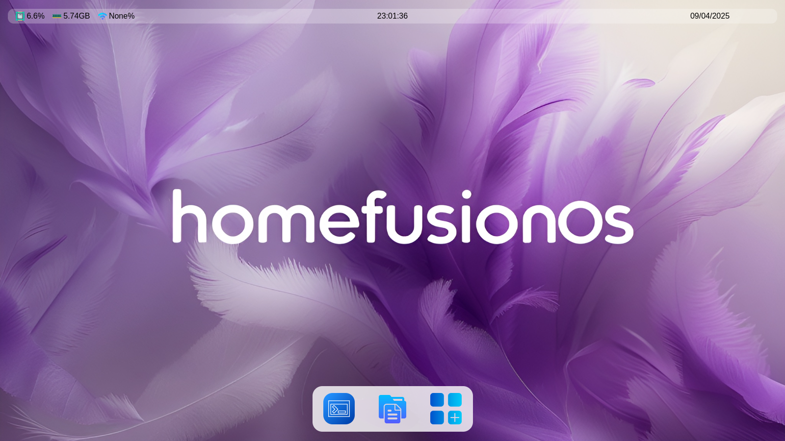
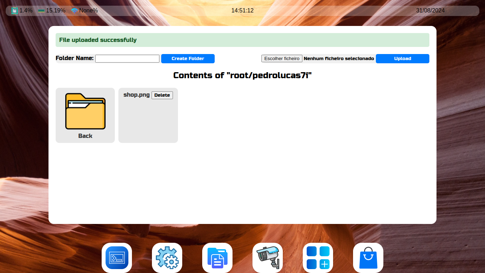
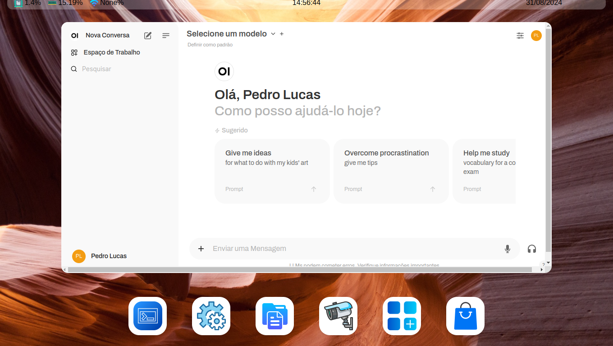

# HomeFusion
 A Home Server with many features
 

## Project Setup

### Install MySQL Server:
```sh
sudo apt install mysql-server -y
```

### Config MySQL Server:

Enter in mysql prompt:
```sh
sudo mysql -u root
```

Change the password (change the 'mynewpassword' for your password):
```sh
ALTER USER 'root'@'localhost' IDENTIFIED WITH mysql_native_password BY 'mynewpassword';
```

```sh
FLUSH PRIVILEGES;
```

Create database and tables in MySQL prompt:
```sh
CREATE DATABASE ludro;


USE ludro;


CREATE TABLE users (
    id INT AUTO_INCREMENT PRIMARY KEY,
    username VARCHAR(255) NOT NULL UNIQUE,
    password VARCHAR(255) NOT NULL
);


CREATE TABLE access (
    id INT AUTO_INCREMENT PRIMARY KEY,
    user_id INT NOT NULL,
    access_level VARCHAR(50),
    ip_address VARCHAR(45),
    os_name VARCHAR(50),
    user_agent TEXT,
    created_at TIMESTAMP DEFAULT CURRENT_TIMESTAMP,
    FOREIGN KEY (user_id) REFERENCES users(id)
);


CREATE TABLE wallpapers_and_theme_for_user (
    id INT AUTO_INCREMENT PRIMARY KEY,
    user_id INT NOT NULL,
    wallpaper_path VARCHAR(255),
    theme VARCHAR(50),
    applied_at TIMESTAMP DEFAULT CURRENT_TIMESTAMP,
    FOREIGN KEY (user_id) REFERENCES users(id)
);

CREATE TABLE docker_containers (
    id INT AUTO_INCREMENT PRIMARY KEY,
    name VARCHAR(255) NOT NULL,
    port VARCHAR(255) NOT NULL,
    installed BOOLEAN DEFAULT FALSE,
    icon VARCHAR(255) NULL
);

INSERT INTO docker_containers (name, port, installed, icon) VALUES ('pihole', '8090/admin', FALSE, '/static/icons/pihole.png');
```

Exit MySQL prompt:
```sh
quit
```

### Config App

Create venv (necessary):
```sh
python -m venv server
```

Activate venv (necessary):
```sh
source server/bin/activate
```

Install dependencies:
```sh
pip3 install -r requirements.txt
```

Copy the `.env` file:
```sh
cp .env.example .env
```

Change the .env to your configuration

## Login

Create the user and password for login:
```sh
python3 create_user_password.py
```

## Start Server Application

Run:
```sh
python3 app.py
```

## Result
### Files


### Prompt


### Ollama (AI)


